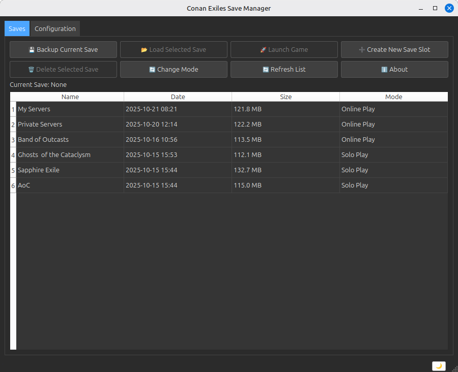

# Conan Exiles Save Manager

A professional PySide6 desktop application for managing Conan Exiles game saves with selective backup/restore functionality.



## Features

- **Automatic Steam Detection**: Automatically finds your Steam installation and Conan Exiles game folder
- **Selective Backup/Restore**: Configure exactly which files and folders to backup and restore
- **Save Categorization**: Mark saves as "Solo Play" or "Online Play" for easy organization
- **Theme Support**: Light and dark mode with consistent styling
- **Game Integration**: Launch Conan Exiles directly and auto-restore saves when you exit
- **Progress Tracking**: Real-time progress bars for all file operations
- **Cross-Platform**: Works on Windows and Linux

## Installation

### Prerequisites
- Python 3.10+
- PySide6 (Qt for Python)

### Setup
1. Clone this repository:
   ```bash
   git clone https://github.com/quantumpixelator/conan-exiles-save-manager.git
   cd conan-exiles-save-manager
   ```

2. Create a virtual environment:
   ```bash
   python3 -m venv venv
   source venv/bin/activate
     # On Windows: venv\Scripts\activate
   ```

3. Install dependencies:
   ```bash
   pip install PySide6
   ```

## Usage

1. Run the application:
   ```bash
   python main.py
   ```

2. **First Time Setup**:
   - The app will detect your Steam installation automatically
   - If not found, select your Steam folder manually
   - Go to the "Configuration" tab and select which files/folders to backup

3. **Backup Saves**:
   - Click "💾 Backup Current Save"
   - Enter a name for your backup
   - Choose play mode (Solo or Online)
   - The app copies your configured files to a timestamped folder

4. **Load Saves**:
   - Select a save from the list
   - Click "📂 Load Selected Save"
   - Confirm overwrite of current game save

5. **Launch Game**:
   - Select a save to load
   - Click "🚀 Launch Game"
   - Play Conan Exiles
   - When you exit, the app automatically restores your save

## Configuration

The "Configuration" tab allows you to select which files and folders within the ConanSandbox directory to include in backups:

- Check folders like `Saved/`, `Mods/`, etc.
- Only selected items will be backed up and restored
- This prevents backing up unnecessary files

## Save Management

- **Create New**: Create a new save slot and immediately backup
- **Delete**: Remove unwanted save folders
- **Change Mode**: Update the play mode for existing saves
- **Refresh**: Reload the save list

## File Structure

```
conan-exiles-save-manager/
├── main.py                 # Main application
├── config.json            # Backup configuration
├── logs/
│   └── app.log           # Application logs
└── saved/                # Save backups
    ├── save_name_1/
    │   ├── metadata.json
    │   └── game_files...
    └── save_name_2/
```

## Requirements

- **Python**: 3.10 or higher
- **PySide6**: For the GUI
- **Conan Exiles**: Installed via Steam
- **Steam**: For game launching

## Troubleshooting

- **Steam not detected**: Select Steam folder manually when prompted
- **Game folder not found**: Ensure Conan Exiles is installed and the ConanSandbox folder exists
- **Permission errors**: Run the app with appropriate permissions for file access
- **Qt errors**: Ensure PySide6 is properly installed

## Contributing

1. Fork the repository
2. Create a feature branch
3. Make your changes
4. Test thoroughly
5. Submit a pull request

## License

This project is licensed under the MIT License - see below:

```
MIT License

Copyright (c) 2025 Quantum Pixelator

Permission is hereby granted, free of charge, to any person obtaining a copy
of this software and associated documentation files (the "Software"), to deal
in the Software without restriction, including without limitation the rights
to use, copy, modify, merge, publish, distribute, sublicense, and/or sell
copies of the Software, and to permit persons to whom the Software is
furnished to do so, subject to the following conditions:

The above copyright notice and this permission notice shall be included in all
copies or substantial portions of the Software.

THE SOFTWARE IS PROVIDED "AS IS", WITHOUT WARRANTY OF ANY KIND, EXPRESS OR
IMPLIED, INCLUDING BUT NOT LIMITED TO THE WARRANTIES OF MERCHANTABILITY,
FITNESS FOR A PARTICULAR PURPOSE AND NONINFRINGEMENT. IN NO EVENT SHALL THE
AUTHORS OR COPYRIGHT HOLDERS BE LIABLE FOR ANY CLAIM, DAMAGES OR OTHER
LIABILITY, WHETHER IN AN ACTION OF CONTRACT, TORT OR OTHERWISE, ARISING FROM,
OUT OF OR IN CONNECTION WITH THE SOFTWARE OR THE USE OR OTHER DEALINGS IN THE
SOFTWARE.
```

## Disclaimer

This tool is not affiliated with Funcom or Steam. Use at your own risk. Always backup your saves manually before using any save management tool.